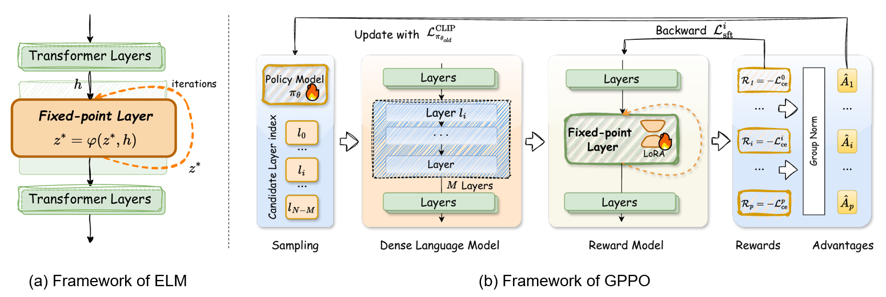
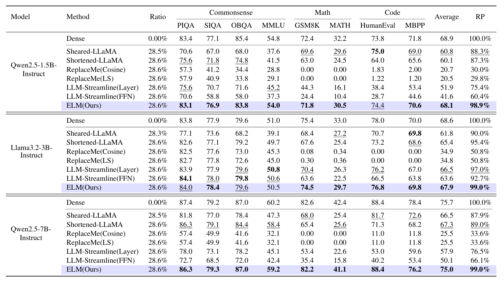

# ELM (WIP)
This repository is the official implementation of [ICLR'26][Equilibrium Language Models](https://openreview.net/pdf?id=lqJT6xmuH3). 



## Requirements

To install requirements:

```setup
pip install -r requirements.txt
```

We use `bigcode-evaluation-harness` to evaluate code synthesis tasks:
```setup
git clone https://github.com/bigcode-project/bigcode-evaluation-harness.git
cd bigcode-evaluation-harness
pip install -e .
```

## Datasets
We recommend the following form to organize datasets:
```datasets_form
└─datasets
    ├─train_set_1
    |   └─train.json
    ├─train_set_2
    |   └─train.json
    ├─test_set_1
    |   └─train.json
    └─test_set_2
        └─test.json
```
Here we provide mathematical reasoning datasets for reference. As illustrated in paper, the training set is MetaMathQA and the evaluation dataset is GSM8K and MATH. In repository we provide example training datas as the demonstration and the full datasets can be achieved in corresponding [huggingface](https://huggingface.co/datasets/meta-math/MetaMathQA). The evaluation dataset is achieved from [github](https://github.com/meta-math/MetaMath/tree/main/data/test).

## Training

### LoRA
We use lora finetuning for specific tasks to output target format. Set corresponding path in scripts and run
```bash
bash scripts/finetuning_lora_qwen2.5_1.5b.sh
```

### ELM
Based on trained lora weights, we can compress the LLMs into our proposed ELMs through replacing layer groups as a single fixed-point transformer layer:
```bash
bash scripts/finetuning_elm_qwen2.5_1.5b.sh
```

### GPPO
The interval of replaced layer groups has significant influence on the performance of ELMs. We propose GPPO search algorithm to automatically produce the probability of the best start of layer given the number of layers to be pruned.
```bash
bash scripts/finetuning_gppo_qwen2.5_1.5b.sh
``` 

## Evaluation
We provide evaluation in `evaluate.py` and an example script as:
```bash
bash scripts/eval_elm_math_qwen2.5_1.5b.sh
```


## Inference
For better adapation, we provide a simple implementation of ELM for inference with `transformers`.
- Use `convert_to_hf.py` to transform trained weights saved by our training framework into an integrated ELM safetensor.
- Use `infer.py` to run example inference.


## Results

We compare ELM with other pruning methods, including Sheared-LLaMA, Shortened-Llama, ReplaceMe, LLM-Streamline. We prune 8 layers of Qwen2.5-1.5B/Qwen2.5-7B/Llama3.1-3B (28% non-embedding parameters) and finetune on different specific tasks. ELMs achieve siginificant improvements. Details are available in our paper.

